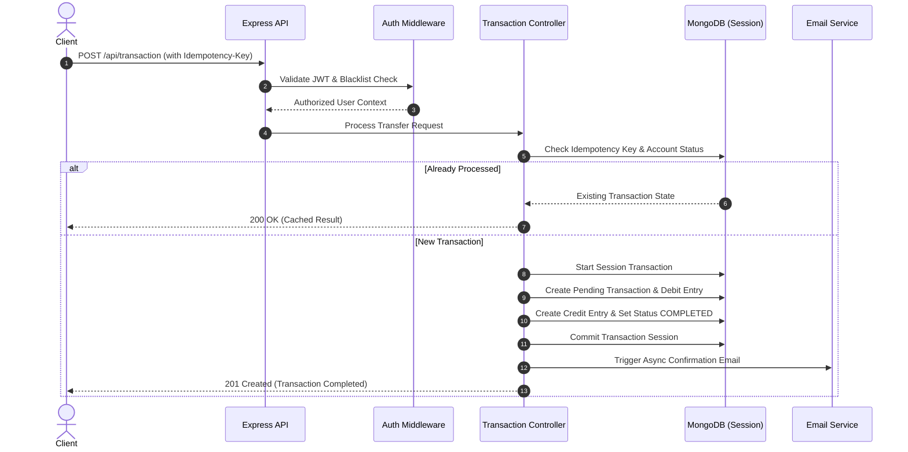

# Double-Entry Financial Ledger API 🏦

[](https://nodejs.org/)
[](https://expressjs.com/)
[](https://www.mongodb.com/)
[](https://opensource.org/licenses/ISC)

A production-ready **Double-Entry Financial Ledger Backend** built with **Node.js, Express, and MongoDB**. Designed to handle monetary transfers reliably by guaranteeing **ACID compliance**, **idempotency**, **immutable audit trails**, and **real-time aggregated balance calculations**.

---

## 📌 Why This Architecture? (Engineering Decisions)

In real-world financial systems, storing a mutable `balance` column on an account record is dangerous due to race conditions, concurrent request conflicts, and lack of auditability. 

This project solves those problems using industrial ledger architecture:

### 1. ⚖️ Double-Entry Accounting
Every transaction creates **two immutable ledger records**:
- A **`DEBIT`** entry on the sender's account.
- A **`CREDIT`** entry on the recipient's account.
- Account balances are never directly updated; they are dynamically computed via MongoDB Aggregation Pipelines: `Balance = Sum(CREDIT) - Sum(DEBIT)`.

### 2. 🛡️ Idempotency Engine
To protect against duplicate charges caused by network timeouts or aggressive client retries:
- Every transaction request requires a unique `idempotencyKey`.
- The system checks transaction state (`PENDING`, `COMPLETED`, `FAILED`, `REVERSED`) before execution, returning cached results for duplicate keys without re-executing funds transfer.

### 3. 🔒 ACID Transactions (`mongoose.startSession()`)
- Fund transfers execute inside MongoDB session transactions.
- If creating the debit entry, credit entry, or transaction state update fails at any step, the entire transaction **automatically rolls back**, ensuring data integrity.

### 4. 🔑 Security & Authorization
- **JWT & HTTP-Only Cookies**: Secure session management.
- **Token Blacklisting**: Revoked tokens are saved in a blackList collection with a **MongoDB TTL index** (`expireAfterSeconds: 3 days`) for automatic cleanup.
- **System-Level RBAC**: Protected initial-funds endpoints restricted to verified system users (`authSystemUserMiddleware`).

---

## 🏗️ System Architecture & Data Flow



---

## 📁 Repository Structure

```text
backendLedger/
├── src/
│   ├── config/          # MongoDB connection pool setup
│   ├── controllers/     # Business logic (Auth, Account, Transaction)
│   ├── middleware/      # Auth, RBAC, and Token Blacklist verification
│   ├── models/          # Mongoose Schemas (User, Account, Transaction, Ledger, Blacklist)
│   ├── routes/          # Express route definitions
│   └── services/        # Nodemailer email dispatch services
├── .env.example         # Environment configuration template
├── .gitignore            # Git exclusion rules
├── package.json         # Project dependencies & scripts
├── server.js            # Server entry point
└── README.md            # Technical documentation
```

---

## 🌐 API Reference

### 🔐 Authentication (`/api/auth`)

| Method | Endpoint | Description | Auth Required |
| :--- | :--- | :--- | :--- |
| `POST` | `/api/auth/register` | Register a new user | ❌ No |
| `POST` | `/api/auth/login` | Authenticate user & receive JWT cookie | ❌ No |
| `POST` | `/api/auth/logout` | Revoke session & blacklist active JWT | ✅ Yes |

#### Register Request Sample:
```json
{
  "username": "johndoe",
  "email": "johndoe@example.com",
  "password": "SecurePassword123"
}
```

---

### 💳 Accounts (`/api/account`)

| Method | Endpoint | Description | Auth Required |
| :--- | :--- | :--- | :--- |
| `POST` | `/api/account/` | Create account for authenticated user | ✅ Yes |
| `GET` | `/api/account/` | Fetch all accounts owned by user | ✅ Yes |
| `GET` | `/api/account/balance/:accountId` | Compute real-time balance from ledger | ✅ Yes |

---

### 💸 Transactions & Ledger (`/api/transaction`)

| Method | Endpoint | Description | Auth Required |
| :--- | :--- | :--- | :--- |
| `POST` | `/api/transaction/` | Execute double-entry transfer | ✅ Yes |
| `POST` | `/api/transaction/system/initial-funds` | Inject initial system funds | 🛡️ System User Only |

#### Transaction Request Sample:
```json
{
  "fromAccount": "66a0123456789abcdef01234",
  "toAccount": "66a0987654321fedcba43210",
  "amount": 250,
  "idempotencyKey": "tx-uuid-9876-5432-1098"
}
```

---

## 🛠️ Getting Started Locally

### Prerequisites
- **Node.js**: `v18.0.0` or higher
- **MongoDB**: Local MongoDB instance or MongoDB Atlas cluster

### 1. Clone & Install Dependencies
```bash
git clone https://github.com/Debajit06/backendLedger.git
cd backendLedger
npm install
```

### 2. Configure Environment Variables
Create a `.env` file in the root directory (refer to `.env.example`):
```env
PORT=8080
MONGO_URI=mongodb+srv://<user>:<password>@cluster0.mongodb.net/backendLedger
JWT_SECRET=your_jwt_secret_key

# Email Notification Setup (Gmail App Password or OAuth2)
EMAIL_USER=your_email@gmail.com
EMAIL_PASS=your_16_char_app_password
```

### 3. Run the Server
```bash
# Development mode (with auto-reload)
npm run dev

# Production mode
npm start
```

---

## 📄 License
Distributed under the **ISC License**. See `LICENSE` for more details.
